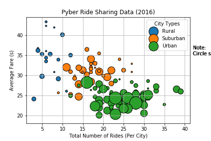
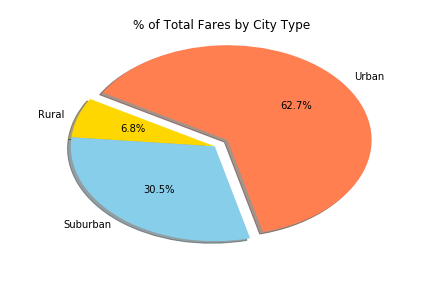
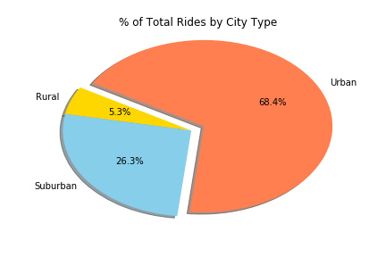
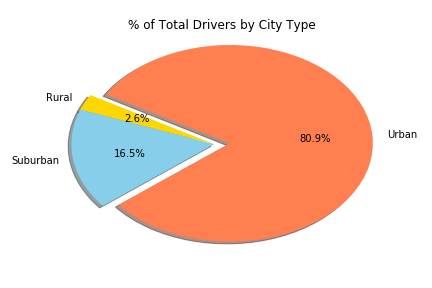

# Pyber-The Power of Plots
The purpose of this project is to act as a data driven leader of a company in the ride-sharing business. The records for the company include all actvive drivers, historic rides, and details such as city, driver count, individual fares, and city types.

## The first objective is to build a buble plot using Matplotlib that showcases the relationship between four key variables:
  * Average Fare ($) Per City
  * Total Number of Rides Per City
  * Total Number of Drivers Per City
  * City Type (Urban, Suburban, Rural)

## The second objective is to produce three pie charts using Matplotlib
 * % of Total Fares by City Type
 * % of Total Rides by City Type
 * % of Total Drivers by City Type
 

  

## Instructions and Explanations
 * The csv files were were left in the folder as a reference guide
 * The 4 image.png files were generated and saved nto the images folder
 * The main file is named pyber_valmont_.ipynb
 * The conclusion document is a word docuent titled Valmont_PyberExercise
